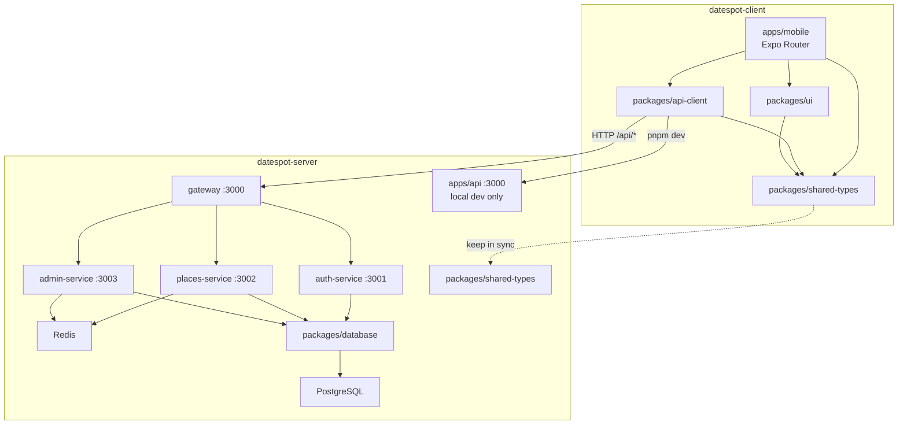
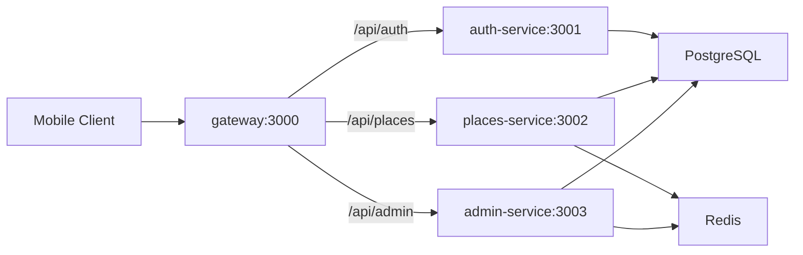

# DateSpot — System Architecture

System architecture for **DateSpot** — a mobile app for discovering date spots, backed by a Node.js REST API with in-app admin.

This document covers **this repo** (`datespot-client`) and the sibling backend at `../datespot-server`.

## Overview

DateSpot consists of two sibling repositories:

| Repository | Role |
|------------|------|
| `datespot-client` (this repo) | Expo React Native mobile app + shared client packages |
| `datespot-server` | Node.js + Express REST API, PostgreSQL, Redis |



## Product Goals

- Discover date spots by location, category, and distance
- Registered users with JWT authentication; freemium tiers (FREE / PREMIUM / VIP)
- FREE tier: first 5 places unlocked; remaining places are locked
- i18n: Hebrew (default), English, Arabic — including RTL layouts
- Admin: in-app admin panel (no separate web admin UI)

## Tech Stack

| Layer | Technology |
|-------|------------|
| Mobile | Expo, React Native, Expo Router, NativeWind, TanStack Query |
| HTTP client | Axios + JWT interceptors (`@datespot/api-client`) |
| Backend | Node.js, Express, Zod validation |
| Database | PostgreSQL + Prisma |
| Cache | Redis (Docker microservices mode) |
| Auth | JWT + bcrypt |
| Monorepo | pnpm workspaces + Turborepo |
| Deploy | Railway (API), Expo Go / native builds (mobile) |

---

## Client — `datespot-client`

Detailed client monorepo map: [docs/ARCHITECTURE.md](docs/ARCHITECTURE.md)

### Monorepo structure

| Path | Package | Role |
|------|---------|------|
| `apps/mobile` | `mobile` | Expo app — routing, i18n, RTL, in-app admin |
| `packages/api-client` | `@datespot/api-client` | Axios client + endpoint wrappers |
| `packages/ui` | `@datespot/ui` | Shared React Native UI components |
| `packages/shared-types` | `@datespot/shared-types` | TypeScript types mirrored from server API |

### Client data flow

1. `apps/mobile/app/_layout.tsx` — global providers (React Query, auth, i18n)
2. `configureApiBaseUrl()` reads `EXPO_PUBLIC_API_URL`
3. Screens call `@datespot/api-client` only (no raw `fetch` or duplicate Axios setup)
4. JWT stored in AsyncStorage; 401 clears auth and triggers redirect to login

### Cross-cutting concerns (client)

| Concern | Location | Notes |
|---------|----------|-------|
| API base URL | `apps/mobile/.env` → `EXPO_PUBLIC_API_URL` | Set in root layout via `configureApiBaseUrl()` |
| Google Maps | `EXPO_PUBLIC_GOOGLE_MAPS_KEY` | Required for maps (PRD 9.2) |
| Auth / JWT | `packages/api-client/src/http.ts` | Token in AsyncStorage; 401 clears auth |
| Data fetching | `@tanstack/react-query` in `_layout.tsx` | Default `staleTime: 30s`, `retry: 1` |
| i18n | `apps/mobile/src/i18n/` | Default `he`; locales `he`, `en`, `ar` |
| RTL | `apps/mobile/src/i18n/i18n.ts` | Hebrew and Arabic enable RTL via `I18nManager` |
| Styling | NativeWind + Tailwind | Shared theme in `packages/ui/src/theme/` |

### Environment (mobile)

| Variable | Required | Description |
|----------|----------|-------------|
| `EXPO_PUBLIC_API_URL` | Yes | API base URL (`http://localhost:3000` or Railway) |
| `EXPO_PUBLIC_GOOGLE_MAPS_KEY` | Yes (PRD) | Google Maps Platform key |

### Commands

```bash
pnpm install
pnpm dev          # Expo (LAN)
pnpm build        # Build all packages
pnpm lint         # Lint all packages
```

---

## Server — `datespot-server`

Detailed server map: [../datespot-server/docs/ARCHITECTURE.md](../datespot-server/docs/ARCHITECTURE.md)

### Dual runtime modes

Both modes expose the same URL paths under `/api/*` on port 3000.

| Mode | Command | What runs |
|------|---------|-----------|
| **Local dev (monolith)** | `pnpm dev` | `apps/api` — all routes in one Express app |
| **Docker (microservices)** | `docker compose up --build` | auth + places + admin + nginx gateway |

**Known behavior drift (documented, not yet unified):**

- `auth-service` applies login rate limiting; `apps/api` does not
- `places-service` and `admin-service` use Redis caching; `apps/api` does not use Redis despite `REDIS_URL` in its env schema

When changing API behavior, update the relevant microservice **and** the matching route file in `apps/api` unless the task explicitly targets one mode only.

### Monorepo structure

| Path | Port | Role |
|------|------|------|
| `apps/api` | 3000 (local) | Monolith for `pnpm dev` |
| `apps/auth-service` | 3001 (internal) | `/api/auth` — register, login, change password |
| `apps/places-service` | 3002 (internal) | `/api/places` — list, detail, save/unsave |
| `apps/admin-service` | 3003 (internal) | `/api/admin` — stats, places CRUD, users |
| `apps/gateway` | 3000 (external) | nginx reverse proxy |
| `packages/database` | — | Prisma schema, migrations, seed |
| `packages/shared-types` | — | Shared TypeScript types |
| `packages/utils` | — | Haversine distance, password generation |

### Request flow (Docker)



### Gateway routing

Defined in `../datespot-server/apps/gateway/nginx.conf`:

| Path prefix | Upstream |
|-------------|----------|
| `/api/auth` | `auth-service:3001` |
| `/api/places` | `places-service:3002` |
| `/api/admin` | `admin-service:3003` |
| `/health` | Gateway stub (200 OK) |

Docker also runs: `postgres`, `redis`, `db-init` (migrations + seed).

### API endpoints (summary)

**Auth** — `/api/auth`

| Method | Path | Auth | Description |
|--------|------|------|-------------|
| POST | `/register` | No | Register user; auto-generate password |
| POST | `/login` | No | Login; returns JWT + user |
| POST | `/change-password` | JWT | Change password |

**Places** — `/api/places`

| Method | Path | Auth | Description |
|--------|------|------|-------------|
| GET | `/` | Optional | List places (category, lat/lng/radius, language) |
| GET | `/:id` | Optional | Place detail |
| GET | `/saved` | JWT | User's saved places |
| POST | `/save` | JWT | Bookmark a place |
| DELETE | `/save/:placeId` | JWT | Remove bookmark |

**Admin** — `/api/admin` (JWT + `isAdmin`)

| Method | Path | Description |
|--------|------|-------------|
| GET | `/stats` | Dashboard statistics |
| GET/POST/PUT/DELETE | `/places`, `/places/:id`, `/places/:id/order` | Places CRUD |
| GET | `/users` | Paginated user list |
| PUT | `/users/:id/subscription` | Update subscription tier |

### Freemium lock logic

- **List:** Places beyond index 5 get `isLocked: true` for FREE users
- **Detail:** FREE users get `403 Premium required` if place rank ≥ 5 by `displayOrder`
- PREMIUM and VIP tiers bypass the lock

### Data model (Prisma)

| Model | Purpose |
|-------|---------|
| **User** | phone, email, `subscriptionTier` (FREE/PREMIUM/VIP), `isAdmin` |
| **Place** | names and descriptions in he/en/ar, category, coordinates, images, openingHours |
| **SavedPlace** | User bookmark for a place |

Schema: `../datespot-server/packages/database/prisma/schema.prisma`

### Cross-cutting concerns (server)

| Concern | Location | Notes |
|---------|----------|-------|
| Database | `packages/database` | Single Prisma schema; all services use `DATABASE_URL` |
| JWT auth | Each service's `middleware/auth.middleware.ts` | Shared `JWT_SECRET`; payload: `userId`, `isAdmin`, `subscriptionTier` |
| Env validation | Each app's `src/config/env.ts` | Zod schemas; fail fast at startup |
| Redis cache | `places-service`, `admin-service` | Key prefix `places:list:*`, TTL 120s; invalidated on admin place mutations |
| i18n | Places routes | Query param `language`: `he`, `en`, `ar` |

### Environment (server — core)

| Variable | Required | Description |
|----------|----------|-------------|
| `DATABASE_URL` | Yes | PostgreSQL connection string |
| `JWT_SECRET` | Yes | Min 32 characters |
| `PORT` | No | Default `3000` |
| `REDIS_URL` | Microservices | Redis for caching |
| `CORS_ORIGIN` | No | Allowed origins for Expo Web (default `*`) |

### Commands

```bash
cd ../datespot-server
pnpm install
docker compose up --build   # Recommended for mobile testing
# Or local monolith:
pnpm db:migrate && pnpm db:seed && pnpm dev
```

**E2E:** run from sibling `e2e/` repo — see [e2e/README.md](../../../e2e/README.md).

**Default seed admin:** `admin@datespot.co.il` / `admin123`

---

## Cross-repo sync rules

| Topic | Rule |
|-------|------|
| Types | Keep `packages/shared-types` aligned with `../datespot-server/packages/shared-types` |
| API behavior | Route change → update microservice **and** `apps/api/src/routes/` (unless single-mode task) |
| Admin UI | Mobile app only; server exposes `/api/admin/*` only |

---

## Implementation status

**Implemented (MVP):**

- User registration/login with JWT + bcrypt
- Places list, detail, save/unsave, FREE-tier lock logic
- Admin API: stats, places CRUD, user management (consumed by mobile app)
- Prisma schema, migrations, seed data (10 places in Tel Aviv)
- i18n in mobile: Hebrew, English, Arabic with RTL

**Planned (next phase):**

- Full Redis response caching parity in monolith
- SendGrid / AWS SES transactional email
- S3 / Cloudinary image uploads
- Google Places API import script
- Firebase push notifications, Stripe/Tranzila payments (v2)

---

## Where to change what

| Task | Start here |
|------|------------|
| New screen or navigation | `apps/mobile/app/` |
| API call or endpoint wrapper | `packages/api-client/src/` |
| Shared UI component | `packages/ui/src/components/` |
| API request/response shape | `packages/shared-types` (+ sync server) |
| New auth endpoint | `../datespot-server/apps/auth-service/src/routes/` + `../datespot-server/apps/api/src/routes/auth.routes.ts` |
| Places list / save / lock | `../datespot-server/apps/places-service/src/routes/` + `../datespot-server/apps/api/src/routes/places.routes.ts` |
| Admin stats / CRUD | `../datespot-server/apps/admin-service/src/routes/` + `../datespot-server/apps/api/src/routes/admin.routes.ts` |
| Schema / migration | `../datespot-server/packages/database/prisma/schema.prisma` |
| Gateway routing | `../datespot-server/apps/gateway/nginx.conf` |
| Docker stack | `../datespot-server/docker-compose.yml` |
| Translations | `apps/mobile/src/i18n/locales/{he,en,ar}.json` |

---

## Documentation index

| Document | Audience | Purpose |
|----------|----------|---------|
| This file | Everyone | System-wide architecture |
| [docs/ARCHITECTURE.md](docs/ARCHITECTURE.md) | Client work | Client monorepo map |
| [../datespot-server/docs/ARCHITECTURE.md](../datespot-server/docs/ARCHITECTURE.md) | Server work | Server monorepo map |
| [README.md](README.md) | Humans | Mobile setup, env, E2E checklist |
| [../datespot-server/README.md](../datespot-server/README.md) | Humans | API setup, deploy, tech stack |
| [AGENTS.md](AGENTS.md) | AI agents | Client conventions |
| [../datespot-server/AGENTS.md](../datespot-server/AGENTS.md) | AI agents | Server conventions |
