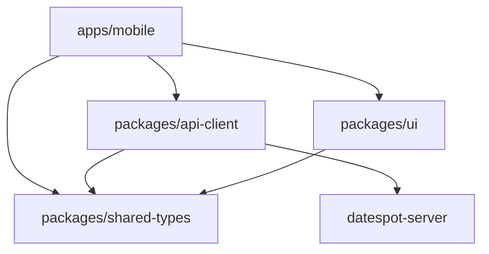

# DateSpot Client — Architecture

Orchestration map for the `datespot-client` pnpm + Turborepo monorepo.

## Monorepo map

| Path | Package name | Role |
|------|--------------|------|
| `apps/mobile` | `mobile` | Expo React Native app (Expo Router, i18n/RTL, in-app admin) |
| `packages/api-client` | `@datespot/api-client` | Axios client with JWT interceptors |
| `packages/ui` | `@datespot/ui` | Shared React Native UI components |
| `packages/shared-types` | `@datespot/shared-types` | TypeScript types mirrored from the server API |

## Dependency graph

- **mobile** depends on all three workspace packages.
- **api-client** and **ui** depend on **shared-types** only.
- Runtime API calls go to **datespot-server** (sibling repo at `../datespot-server`).

## Cross-cutting concerns

| Concern | Location | Notes |
|---------|----------|-------|
| API base URL | `apps/mobile/.env` → `EXPO_PUBLIC_API_URL` | Configured in root layout via `configureApiBaseUrl()` |
| Google Maps | `EXPO_PUBLIC_GOOGLE_MAPS_KEY` | Required for maps (PRD 9.2) |
| Auth / JWT | `packages/api-client/src/http.ts` | Token in AsyncStorage; 401 clears auth and triggers redirect |
| Data fetching | `@tanstack/react-query` in `apps/mobile/app/_layout.tsx` | Default `staleTime: 30s`, `retry: 1` |
| i18n | `apps/mobile/src/i18n/` | Default language `he`; locales `he`, `en`, `ar` |
| RTL | `apps/mobile/src/i18n/i18n.ts` | Hebrew and Arabic enable RTL via `I18nManager` |
| Styling | NativeWind + Tailwind in mobile | Shared theme colors also in `packages/ui/src/theme/` |

## Where to change what

| Task | Start here |
|------|------------|
| New screen or navigation | `apps/mobile/app/` |
| Auth guard, providers, global config | `apps/mobile/app/_layout.tsx` |
| API call or endpoint wrapper | `packages/api-client/src/` |
| Admin API calls | `packages/api-client/src/admin.ts` |
| Shared button, input, card | `packages/ui/src/components/` |
| API response / request shape | `packages/shared-types/src/index.ts` (+ sync server) |
| Translations | `apps/mobile/src/i18n/locales/{he,en,ar}.json` |
| App-only visuals | `apps/mobile/src/components/` or screen files |

## Backend

The REST API, database, and Docker setup live in the sibling repo:

- [datespot-server/README.md](../../datespot-server/README.md)

Run the API locally (`pnpm dev` in server) or via Docker before testing the mobile app.

## Documentation index

| Doc | Audience | Purpose |
|-----|----------|---------|
| [README.md](../README.md) | Humans | Quick start, env, scripts, E2E checklist |
| [AGENTS.md](../AGENTS.md) | AI agents | Conventions, boundaries, verification |
| This file | Everyone | Monorepo map and task routing |
| [apps/mobile/README.md](../apps/mobile/README.md) | Mobile work | Routes, stack, env, scripts |
| [packages/api-client/README.md](../packages/api-client/README.md) | API client work | Endpoints, HTTP layer |
| [packages/ui/README.md](../packages/ui/README.md) | UI work | Shared components |
| [packages/shared-types/README.md](../packages/shared-types/README.md) | Types work | Type sync with server |
