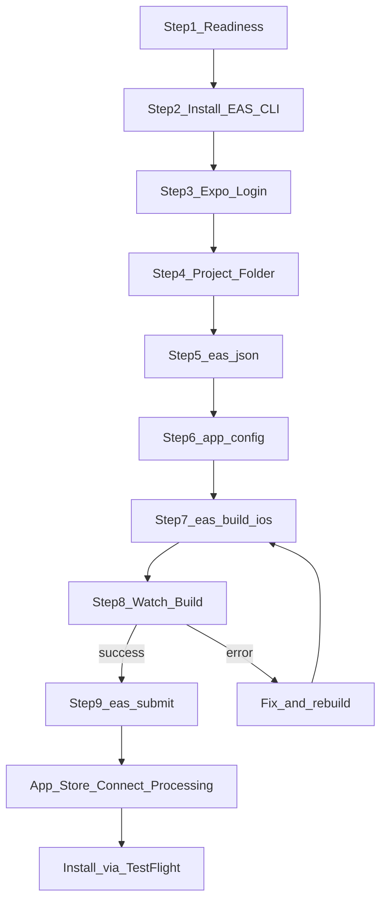

# מדריך לימוד: Expo → TestFlight (DateSpot)

מדריך מודרך להעלאת אפליקציית Expo ל-TestFlight.  
המטרה: להבין **מה** עושים, **למה**, ו**מה קורה מאחורי הקלעים** — לא רק להעתיק פקודות.

**עקרון עבודה:** עברו שלב־שלב. אל תדלגו. אם יש שגיאה — עצרו, הבינו, תקנו, ורק אז המשיכו.

**תיקיית העבודה הנכונה בפרויקט DateSpot:**

```text
datespot-client/apps/mobile
```

זה האפליקציה למובייל. שורש `datespot-client` הוא monorepo (כמה חבילות), לא האפליקציה עצמה.

---

## שלב 1 — בדיקת מוכנות

### למה השלב הזה קיים

לפני שמעלים אפליקציה ל-iPhone, צריך לוודא שיש:

1. **רשות מ-Apple** לפרסם אפליקציות (חשבון מפתחים בתשלום).
2. **חשבון Expo** — השירות שבונים אצלם את קובץ ההתקנה בענן.
3. **כלים במחשב** שמריצים את הפקודות.
4. **פרויקט מסוג נכון** (Expo Managed).

אם נדלג: תיתקעו באמצע עם שגיאות לא ברורות (אין הרשאה ב-Apple, פקודה לא נמצאת, תיקייה לא נכונה).

### 1.1 חשבון Apple Developer

**מה זה:** מנוי שנתי של Apple למפתחים. בלי זה אי אפשר להעלות אפליקציה ל-TestFlight או ל-App Store.

**איך בודקים:**

1. היכנסו ל-[developer.apple.com/account](https://developer.apple.com/account).
2. התחברו עם Apple ID.
3. אם אתם רואים לוח בקרה של Account / Membership — יש חשבון.
4. ודאו שהמנוי **Active** (פעיל) ולא פג תוקף.

**טעות נפוצה:** יש Apple ID רגיל (iCloud) אבל **אין** מנוי Developer בתשלום.  
**איך מזהים:** ב-EAS/Apple תופיע שגיאה על membership / team.  
**פתרון:** הירשמו ל-[Apple Developer Program](https://developer.apple.com/programs/) והמתינו לאישור (לפעמים מיידי, לפעמים יום־יומיים).

**עצרו כאן אם אין מנוי פעיל.** בלי זה אי אפשר להמשיך עד TestFlight.

### 1.2 חשבון Expo

**מה זה:** חשבון באתר [expo.dev](https://expo.dev). דרכו מנוהלים Builds, פרויקטים, והעלאות.

**איך בודקים:** היכנסו ל-expo.dev ונסו להתחבר / להירשם.

עדיין לא חייבים להתחבר מהטרמינל — זה יבוא בשלב 3. רק לוודא שיש חשבון.

### 1.3 סוג הפרויקט: Managed מול Bare

| מונח | משמעות פשוטה |
|------|----------------|
| **Managed Workflow** | Expo מנהל את הקוד ה"טבעי" של iOS/Android בשבילכם. אין תיקיית `ios/` קבועה בפרויקט (או שהיא נוצרת זמנית ב-prebuild). |
| **Bare Workflow** | יש תיקיות `ios/` ו-`android/` מלאות שאתם מתחזקים כמו פרויקט React Native רגיל. |

**בדיקה ב-DateSpot:** בתוך `apps/mobile` — אם **אין** תיקיית `ios/` קבועה, וקיים `app.config.ts` + תלויות `expo` — זה **Managed** (CNG / prebuild). DateSpot עובד כך.

**למה זה חשוב:** ב-Managed, הדרך המומלצת ב-2026 היא **EAS Build** (בנייה בענן של Expo), לא Xcode מקומי כברירת מחדל למתחילים.

### 1.4 Node.js, מנהל חבילות, Git

| כלי | למה צריך | אם חסר |
|-----|----------|--------|
| **Node.js** | מריץ JavaScript בצד השרת/כלים (כולל Expo ו-EAS) | התקינו מ-[nodejs.org](https://nodejs.org) (LTS) |
| **npm** | מגיע עם Node; מתקין כלים גלובליים כמו `eas-cli` | מגיע עם Node |
| **pnpm** | DateSpot משתמש ב-pnpm למונורפו | `npm install -g pnpm` |
| **Git** | EAS מצפה לפרויקט עם Git; מעקב שינויים | [git-scm.com](https://git-scm.com) |

הריצו ב-PowerShell (כל פקודה בנפרד) והדביקו את הפלט:

```powershell
node -v
npm -v
pnpm -v
git --version
```

**מה כל פקודה עושה:**

- `node -v` — מדפיס גרסת Node. אם "not recognized" → Node לא מותקן / לא ב-PATH.
- `npm -v` — מדפיס גרסת npm.
- `pnpm -v` — מדפיס גרסת pnpm (חובה ל-DateSpot).
- `git --version` — מדפיס גרסת Git.

**טעויות נפוצות:**

| תסמין | סיבה | פתרון |
|--------|------|--------|
| `node` לא מזוהה אחרי התקנה | הטרמינל לא רוענן / PATH | סגרו ופתחו את הטרמינל; בדקו התקנה מחדש |
| `pnpm` לא מזוהה | לא הותקן גלובלית | `npm install -g pnpm` |
| גרסת Node ישנה מאוד | Expo 54 דורש Node עדכני | התקינו LTS עדכני |

### 1.5 מיקום בתיקייה

```powershell
pwd
Get-ChildItem
```

- `pwd` — מציג את הנתיב הנוכחי.
- `Get-ChildItem` — מציג קבצים ותיקיות (בדומה ל-`ls`).

עברו לתיקיית האפליקציה:

```powershell
cd c:\dev\datespot\datespot-client\apps\mobile
pwd
Get-ChildItem
```

ודאו שאתם רואים לפחות: `package.json`, `app.config.ts`, תיקיית `app/`, וקובץ `eas.json` (אם כבר הוגדר).

### סיכום שלב 1 — צ'קליסט

- [ ] Apple Developer פעיל
- [ ] חשבון Expo קיים
- [ ] הפרויקט Managed (אין `ios/` קבוע שאתם מתחזקים ידנית)
- [ ] `node`, `npm`, `pnpm`, `git` עובדים
- [ ] אתם ב-`apps/mobile`

**רק כשהכול מסומן — עברו לשלב 2.**

---

## שלב 2 — התקנת EAS CLI

### מהו EAS

**EAS** = Expo Application Services.  
זה "המפעל בענן" של Expo: בונים שם קובץ התקנה ל-iPhone/Android, מעלים ל-Store, ומנהלים עדכונים.

### למה Expo משתמש בזה

בעבר היה אפשר לבנות בעיקר מקומית או עם כלים ישנים יותר. ב-2026 הדרך המומלצת ל-Managed היא:

1. אתם כותבים קוד JS/TS.
2. שולחים ל-EAS Build.
3. שרתי Expo בונים את האפליקציה ה"טבעית" (עם חתימה של Apple).
4. אתם מקבלים קובץ מוכן ל-TestFlight / Store.

**יתרון למתחילים:** לא חייבים Mac עם Xcode מוגדר מושלם רק כדי לייצר Build ל-iOS (עדיין תצטרכו חשבון Apple).

### ההבדל בין Expo CLI ל-EAS CLI

| כלי | תפקיד | דוגמה |
|-----|--------|--------|
| **Expo CLI** (`npx expo`) | פיתוח יומיומי: הרצה, QR, prebuild | `npx expo start` |
| **EAS CLI** (`eas`) | הפצה: Build, Submit, Update, Credentials | `eas build`, `eas submit` |

אנלוגיה: Expo CLI = סדנת העבודה בבית. EAS CLI = משלוח למפעל ולחנות.

### התקנה (מומלץ 2026)

```powershell
npm install -g eas-cli
```

**פירוק הפקודה:**

| חלק | משמעות |
|-----|---------|
| `npm` | מנהל החבילות של Node |
| `install` | התקן חבילה |
| `-g` | Global — זמין מכל תיקייה בטרמינל (לא רק בפרויקט) |
| `eas-cli` | שם החבילה של כלי EAS |

לאחר מכן:

```powershell
eas --version
```

צפו למספר גרסה (למשל `16.x` ומעלה — בפרויקט DateSpot ב-`eas.json` מוגדר `cli.version >= 16.0.0`).

**טעויות נפוצות:**

| תסמין | פתרון |
|--------|--------|
| `eas` לא מזוהה אחרי התקנה | סגרו טרמינל ופתחו מחדש; בדקו ש-npm global bin ב-PATH |
| הרשאות ב-Windows/Mac | הריצו כמשתמש רגיל; הימנעו מתיקיות מוגנות |
| גרסה ישנה מדי | `npm install -g eas-cli@latest` |

**אל תמשיכו בלי `eas --version` תקין.**

---

## שלב 3 — התחברות לחשבון Expo

### למה צריך להתחבר

ה-Build רץ על שרתי Expo תחת **החשבון שלכם**. בלי התחברות, EAS לא יודע למי לשייך את הפרויקט והבנייה.

### מה נשמר במחשב

אסימון התחברות (token) נשמר מקומית בפרופיל המשתמש שלכם (לא בתוך קוד האפליקציה ב-Git). זה מאפשר ל-`eas` לעבוד בלי להזין סיסמה בכל פקודה.

### האם זה חד־פעמי

בדרך כלל כן למחשב הזה — עד שתתנתקו (`eas logout`), תמחקו את האסימון, או שהתוקף יפוג ותתבקשו שוב.

### הפקודות

מתוך `apps/mobile` (או מכל מקום אחרי התקנה גלובלית):

```powershell
eas login
```

הזינו אימייל/סיסמה של Expo (או עקבו אחרי הוראות הדפדפן אם מוצע).

אימות:

```powershell
eas whoami
```

אמור להדפיס את שם המשתמש שלכם.

**טעויות נפוצות:**

| תסמין | פתרון |
|--------|--------|
| סיסמה שגויה / 2FA | אפסו סיסמה ב-expo.dev; השלימו אימות |
| התחברתם לחשבון הלא נכון | `eas logout` ואז `eas login` |
| Organization / הרשאות | ודאו שיש לכם גישה לפרויקט DateSpot בארגון הנכון |

---

## שלב 4 — כניסה לתיקיית הפרויקט

### למה

פקודות EAS קוראות קבצים מהתיקייה הנוכחית (`app.config.ts`, `eas.json`, `package.json`). אם אתם בתיקייה הלא נכונה — הכל נכשל או יוצר הגדרות במקום הלא נכון.

### מה להריץ

```powershell
cd c:\dev\datespot\datespot-client\apps\mobile
pwd
Get-ChildItem
```

### קבצים שחייבים להיות שם

| קובץ / תיקייה | תפקיד |
|---------------|--------|
| `package.json` | רשימת תלויות וסקריפטים של האפליקציה |
| `app.config.ts` | הגדרות האפליקציה (שם, מזהה iOS, גרסה…) — אצלנו דינמי במקום `app.json` |
| `app/` | מסכי Expo Router |
| `eas.json` | פרופילי Build/Submit (ב-DateSpot כבר קיים) |

**למה אין `app.json`?**  
אפשר להשתמש ב-`app.json` (סטטי) או ב-`app.config.js` / `app.config.ts` (דינמי). DateSpot משתמש ב-`app.config.ts` כדי להחליף Staging/Production (`APP_VARIANT`).

**טעות נפוצה:** להריץ `eas` מ-`datespot-client` (שורש המונורפו) במקום מ-`apps/mobile`.  
**איך מזהים:** EAS לא מוצא config / יוצר `eas.json` במקום הלא נכון.  
**פתרון:** תמיד `cd apps/mobile` קודם.

---

## שלב 5 — הגדרת EAS (`eas.json`)

### מהו `eas.json`

קובץ הגדרות שאומר ל-EAS **איך** לבנות:

- פרופיל `development` / `preview` / `production`
- האם זה להתקנה פנימית או לחנות
- משתני סביבה (למשל כתובת API)
- הגדרות Submit

### למה הוא נוצר

בלי קובץ כזה, בכל Build הייתם צריכים לענות על אותן שאלות מחדש. הקובץ הוא "מתכון קבוע" לבנייה.

### אם הקובץ עדיין לא קיים

```powershell
cd c:\dev\datespot\datespot-client\apps\mobile
eas build:configure
```

הפקודה יוצרת/מעדכנת `eas.json` ומקשרת את הפרויקט ל-EAS לפי הצורך.

### מצב DateSpot (כבר מוגדר)

בפרויקט כבר קיים `eas.json`. עיקרי הפרופילים:

| פרופיל | שימוש | Bundle (דרך `APP_VARIANT`) | הפצה |
|--------|--------|------------------------------|------|
| `development` | Dev Client | staging | internal |
| `preview` / `staging` | בדיקות פנימיות | staging (`co.il.datespot.app.staging`) | internal |
| `production` | חנות / TestFlight לחנות | production (`co.il.datespot.app`) | store |

שדות חשובים:

- `cli.appVersionSource: "remote"` — מספר הגרסה ל-Build מנוהל גם מצד EAS (עם `autoIncrement` בפרודקשן).
- `production.distribution: "store"` — מיועד להעלאה ל-App Store Connect / TestFlight.
- `submit.production` — פרופיל להעלאה אחרי Build.

**ל-TestFlight של גרסת החנות השתמשו בפרופיל `production`.**

### קישור פרויקט ל-EAS (פעם אחת)

אם עדיין אין `projectId`:

```powershell
eas init
```

ב-DateSpot ה-`projectId` נטען דרך משתנה הסביבה `EAS_PROJECT_ID` לתוך `extra.eas.projectId` ב-`app.config.ts`. ראו גם את ה-README של mobile.

**טעויות נפוצות:**

| תסמין | פתרון |
|--------|--------|
| אין `projectId` | הריצו `eas init` מה-`apps/mobile` |
| Build עם API ל-localhost בפרודקשן | ודאו שמשתמשים בפרופיל `production` (לא `preview`) |
| שינוי `eas.json` בטעות בשורש המונורפו | מחקו שם והגדירו מחדש ב-`apps/mobile` |

---

## שלב 6 — בדיקת `app.config.ts`

DateSpot משתמש ב-`app.config.ts` (לא `app.json`). פתחו והבינו את השדות הבאים.

### שדות מרכזיים

| שדה | חובה? | מה עושה | ב-DateSpot |
|-----|--------|---------|------------|
| `name` | כן | השם שמוצג למשתמש במכשיר | `DateSpot` / `DateSpot Staging` |
| `slug` | כן | מזהה ידידותי בפרויקט Expo (URL וכו') | `datespot` |
| `version` | כן | גרסת האפליקציה שמשתמשים רואים | `1.0.0` |
| `ios.bundleIdentifier` | כן ל-iOS | מזהה ייחודי ב-Apple (כמו ת.ז. של האפליקציה) | `co.il.datespot.app` או `.staging` |
| `android.package` | כן ל-Android | מקביל ל-bundle ב-Android | אותו רעיון |
| `orientation` | לא תמיד | כיוון מסך | `portrait` |
| `scheme` | מומלץ | לינקים עמוקים (`datespot://`) | `datespot` / `datespot-staging` |
| `plugins` | לפי צורך | תוספי Expo native | router, location, asset |
| `extra` | אופציונלי | הגדרות שהאפליקציה קוראת בזמן ריצה | `apiUrl`, `eas.projectId`, `appVariant` |
| `owner` | מומלץ בצוות | בעלות ב-Expo (משתמש/ארגון) | הוסיפו אם הפרויקט תחת ארגון |

### למה `bundleIdentifier` קריטי

Apple מזהה את האפליקציה לפי המחרוזת הזו (למשל `co.il.datespot.app`).  
אם תשנו אותה אחרי שכבר יצרתם אפליקציה ב-App Store Connect — זה נחשב **אפליקציה אחרת**.

### Staging מול Production

כש-`APP_VARIANT=staging` (פרופילי preview/development):

- שם: DateSpot Staging  
- Bundle: `co.il.datespot.app.staging`

כש-production:

- שם: DateSpot  
- Bundle: `co.il.datespot.app`

ל-TestFlight של המוצר האמיתי: **production**.

### `EAS_PROJECT_ID`

בלי `projectId` תקין, EAS לא מקשר נכון את הבניות לפרויקט. הגדירו לפי `eas init` / משתני EAS כפי שמתואר ב-README.

**טעויות נפוצות:**

| תסמין | פתרון |
|--------|--------|
| Bundle ID לא תואם ל-App Store Connect | יישרו את המחרוזת בדיוק |
| שכחתם אייקון/ספלאש | הוסיפו נכסים לפני Build לחנות |
| API מצביע ל-localhost ב-Build לחנות | בדקו `env` בפרופיל `production` ב-`eas.json` |

---

## שלב 7 — יצירת Build ל-iOS

### מהו Build

**קוד מקור** = הקבצים שאתם כותבים (TypeScript, תמונות, הגדרות).  
**Build** = תהליך שממיר את זה לקובץ שאפשר להתקין ב-iPhone (למשל `.ipa`), חתום דיגיטלית ל-Apple.

אנלוגיה: מתכון + מצרכים (קוד) → עוגה אפויה באריזה (Build).

### למה שרתי Expo

בשרתי EAS יש מכונות Mac מוכנות עם כלי Apple. הן:

1. מורידות את הקוד שלכם.
2. מייצרות פרויקט iOS native (prebuild).
3. חותמות עם תעודות.
4. מעלות ארטיפקט מוכן.

### הפקודה המומלצת ל-DateSpot (TestFlight / Store)

מתוך `apps/mobile`:

```powershell
eas build --platform ios --profile production
```

או מהשורש של המונורפו:

```powershell
pnpm --filter mobile build:production:ios
```

(`build:production:ios` מריץ את אותו רעיון עם `--non-interactive` — נוח ל-CI; בפעם הראשונה מומלץ בלי non-interactive כדי לענות על שאלות Credentials.)

### שאלות נפוצות ש-EAS שואל — ומה לבחור

#### Apple Login / Apple ID

**למה:** כדי ליצור/לקרוא תעודות ופרופילים בחשבון המפתחים שלכם.  
**מומלץ:** להתחבר עם ה-Apple ID שיש לו גישה ל-Team הנכון.  
**אם תדלגו:** תצטרכו לנהל Certificates ידנית ב-Apple — קשה יותר למתחילים.

#### Generate credentials automatically? (כן / לא)

| בחירה | יתרון | חיסרון |
|--------|--------|---------|
| **Yes (מומלץ למתחילים)** | EAS מנהל Certificates ו-Provisioning Profiles | פחות שליטה ידנית |
| No | שליטה מלאה | קל לטעות; יותר עבודה |

**Certificate** = תעודה דיגיטלית שמוכיחה שאתם המפתחים.  
**Provisioning Profile** = מסמך שמקשר בין האפליקציה (Bundle ID), התעודה, והרשאות ההתקנה.

#### Bundle Identifier

ודאו שמופיע `co.il.datespot.app` לבניית production (לא staging).  
אם לא — בדקו את הפרופיל ואת `APP_VARIANT`.

#### Distribution: Store

לפרופיל `production` זה נכון ל-TestFlight (TestFlight עובר דרך App Store Connect).

### טעויות נפוצות בשלב הבנייה

| תסמין | סיבה | פתרון |
|--------|------|--------|
| No Apple Developer membership | מנוי לא פעיל | שלב 1 |
| Bundle identifier already used | ID תפוס בצוות אחר | השתמשו ב-ID שבבעלותכם / בקשו גישה |
| Git not clean / no git | EAS מצפה ל-repo | commit או עקבו אחרי הנחיית EAS |
| Wrong directory | לא ב-`apps/mobile` | `cd` נכון |
| Missing privacy permission strings | iOS דורש הסבר למיקום וכו' | כבר מוגדר ל-location ב-plugins; הוסיפו לפי הצורך |

---

## שלב 8 — מעקב אחרי הבנייה

### מה קורה בשרתי Expo

1. התור — הבנייה ממתינה למשאב פנוי.
2. הכנה — התקנת תלויות, prebuild.
3. קומפילציה — Xcode בונה את האפליקציה.
4. חתימה — הוספת Certificates/Profiles.
5. סיום — קישור להורדה / מוכן ל-Submit.

### למה זה לוקח זמן

בניית iOS כוללת קומפילציה כבדה ותור משותף. 10–30 דקות זה נפוץ; לפעמים יותר.

### איך לעקוב

- קישור שמופיע בטרמינל אחרי תחילת ה-Build  
- או [expo.dev](https://expo.dev) → הפרויקט → Builds  
- או:

```powershell
eas build:list --platform ios --limit 5
```

### מה לשלוח כשיש בעיה

- קישור ל-Build  
- או הפלט המלא מהטרמינל  
- או צילום מסך של דף השגיאה ב-expo.dev (לוג)

### ניתוח שגיאות נפוצות

| הודעה / אזור | משמעות | כיוון תיקון |
|--------------|---------|--------------|
| Credentials / certificate | בעיה בחתימה | `eas credentials` → iOS → בדיקה מחדש / יצירה מחדש בזהירות |
| Pod / native module | תלות native לא תואמת | בדקו גרסאות Expo SDK והתאמת חבילות |
| Metro / JS bundle | שגיאת קוד JS בזמן ה-bundle | הריצו `pnpm --filter mobile lint` מקומית ותקנו |
| ENOTFOUND / network | רשת מול Expo | בדקו אינטרנט / VPN / נסו שוב |
| Invalid bundle identifier | לא תואם להגדרות Apple | יישור Bundle ID |

**אל תעברו לשלב 9 לפני שסטטוס ה-Build הוא finished / success.**

---

## שלב 9 — העלאה ל-TestFlight

### מהו TestFlight

אפליקציה של Apple שבה **בודקים** גרסאות לפני פרסום פומבי בחנות.  
מתקינים מה-App Store את אפליקציית TestFlight, ואז מקבלים הזמנה לנסות את DateSpot.

### ההבדל מול App Store

| | TestFlight | App Store |
|--|------------|-----------|
| קהל | בודקים שאתם מזמינים | כולם |
| סטטוס | טרום־פרסום | מפורסם |
| ביקורת Apple | קלה/מהירה יותר ל-Internal; External עובר Review | Review מלא לפרסום |

**לא חייבים לפרסם בחנות** כדי להשתמש ב-TestFlight. מעלים Build ל-App Store Connect ומפיצים לבודקים בלבד.

### מהו App Store Connect

האתר/לוח הבקרה של Apple לניהול האפליקציה: [appstoreconnect.apple.com](https://appstoreconnect.apple.com)  
שם נוצרים רשומת האפליקציה, Testers, ומעקב Processing.

### פקודת ההעלאה

אחרי Build מוצלח ל-iOS (production):

```powershell
cd c:\dev\datespot\datespot-client\apps\mobile
eas submit --platform ios --profile production
```

EAS ישאל איזה Build להעלות (האחרון / בחירה מרשימה / נתיב לקובץ).

### מה קורה במהלך ההעלאה

1. EAS לוקח את קובץ ה-`.ipa`.
2. מעלה אותו ל-App Store Connect בשם הצוות שלכם.
3. Apple מתחילה **Processing** — בדיקות אוטומטיות (כמה דקות עד יותר משעה).

### מה המשמעות של Processing

Apple עדיין מעבדת את הקובץ. **אי אפשר** להתקין ב-TestFlight עד שהסטטוס משתנה למוכן (Ready to Test / דומה).

רענון: App Store Connect → האפליקציה → TestFlight → ה-Build.

### אחרי שהעיבוד נגמר

1. היכנסו ל-App Store Connect → האפליקציה DateSpot (Bundle `co.il.datespot.app`).
2. אם זו הפעם הראשונה — צרו את רשומת האפליקציה עם אותו Bundle ID.
3. לכו ל-**TestFlight**.
4. הוסיפו **Internal Testers** (חברי הצוות ב-App Store Connect, עד מכסה של Apple).
5. שייכו אותם ל-Build.
6. במכשיר iPhone: התקינו **TestFlight** מה-App Store → קבלו הזמנה באימייל/בהתראה → Install.

### Internal מול External Testers

| סוג | מי | הערות |
|-----|-----|--------|
| **Internal** | אנשים בצוות ב-App Store Connect | הכי מהיר להתחלה |
| **External** | בודקים מחוץ לצוות | דורש מידע בסיסי ו-Beta App Review מ-Apple |

למתחילים: התחילו ב-Internal.

### טעויות נפוצות ב-Submit / TestFlight

| תסמין | סיבה | פתרון |
|--------|------|--------|
| No app in App Store Connect | לא נוצרה רשומת אפליקציה | צרו App עם אותו Bundle ID |
| Missing compliance / export | שאלות הצפנה לא מולאו | ענו ב-App Store Connect על Export Compliance |
| Build missing from TestFlight | עדיין Processing או נכשל | המתינו / בדקו מייל מ-Apple |
| Wrong Apple team | כמה צוותים בחשבון | בחרו את ה-Team הנכון ב-EAS וב-ASC |
| Can't install | Tester לא הוזמן / לא קיבל | בדקו מייל, סטטוס Tester, אותו Apple ID במכשיר |

### סיום — ודאו שהבנתם

לפני שאתם חוזרים על התהליך לבד, ודאו שאתם יכולים להסביר במילים שלכם:

1. למה צריך Apple Developer + Expo.  
2. למה עובדים מ-`apps/mobile`.  
3. מה ההבדל בין קוד ל-Build.  
4. למה EAS מנהל Certificates.  
5. מה ההבדל בין TestFlight לפרסום בחנות.  
6. מה לעשות כש-Build נכשל או Processing נתקע.

---

## קיצור דרך DateSpot (אחרי שהבנתם את התהליך)

מתוך `datespot-client`:

```powershell
cd c:\dev\datespot\datespot-client\apps\mobile
npm install -g eas-cli
eas login
eas whoami
eas init   # אם חסר projectId
eas build --platform ios --profile production
eas submit --platform ios --profile production
```

סקריפטים קיימים ב-`package.json` של mobile:

- `pnpm --filter mobile build:production:ios`
- `pnpm --filter mobile build:staging:ios` (לא לחנות / לא אותו Bundle)

סודות (למשל מפתח מפות) — ראו [apps/mobile/README.md](../apps/mobile/README.md).

---

## מפת זרימה



---

## מקורות רשמיים

- [EAS Build](https://docs.expo.dev/build/introduction/)
- [EAS Submit](https://docs.expo.dev/submit/introduction/)
- [App Store Connect / TestFlight](https://developer.apple.com/testflight/)
- תיעוד קצר בפרויקט: [apps/mobile/README.md](../apps/mobile/README.md)
